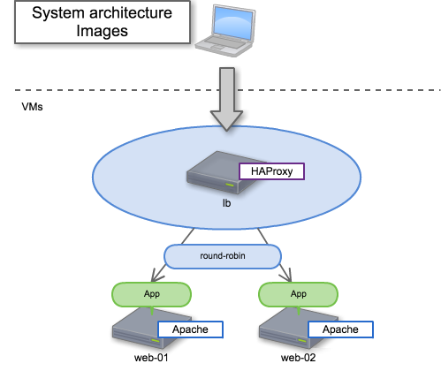

vagrant-haproxy
===============

To provide a demonstration of HAProxy.  
Default proxies in round-robin.  

System architecture
-------------------

Requirements
------------

Please be sure that you install these software.

    VirtualBox
    Vagrant

Getting started
---------------

    # git clone https://github.com/demiglacesource/vagrant-haproxy.git && cd vagrant-haproxy
    # vagrant up
    # vagrant ssh haproxy
    # curl http://localhost
    <h1>101</h1>
    or 
    <h1>102</h1>

Multi-Machine
-------------

vagrant-haproxy is made up of multiple machines.

    HAProxy on CentOS7
    Apache on CentOS7 * $num_instances variable (Vagrantfile)

If you want to run a "vagrant ssh", you would enter the following.

    # vagrant ssh haproxy
    or
    # vagrant ssh web-01 (02, 03, ...)

I use the following private ip.

    HAProxy is 192.168.50.10.
    Apache is 192.168.50.101, 102, 103, ...

Ports
-----

| Guest machine | Service port | 
----------------|--------------|
| haproxy | 80 | 
| web-0n | 80 | 

